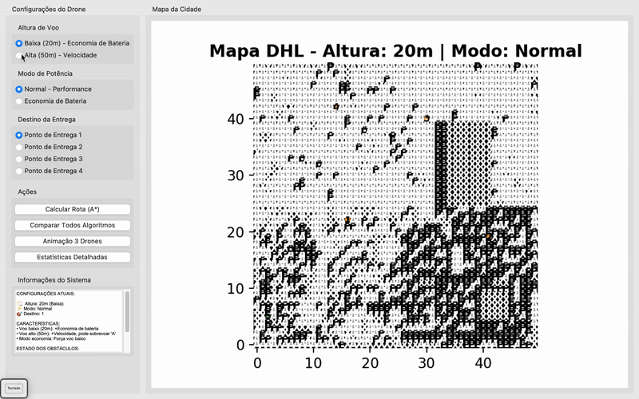

# 🚁 DHL Drone Path Planning System

<div align="center">


**Sistema Inteligente de Roteamento para Drones de Entrega DHL**

*Otimize rotas, economize bateria e supere condições climáticas*

[Visão Geral](#-visão-geral) • [Funcionalidades](#-funcionalidades) • [Algoritmos](#-algoritmos) • [Instalação](#-instalação) • [Uso](#-uso) • [Estrutura](#-estrutura)

</div>

## 🌟 Visão Geral

O **DHL Drone Path Planning System** é uma solução avançada de inteligência artificial para otimização de rotas de drones de entrega. Desenvolvido para a DHL, o sistema utiliza três algoritmos de busca diferentes para calcular rotas eficientes considerando múltiplos fatores como consumo de bateria, condições climáticas e obstáculos urbanos.

# Demo Animation


## 🚀 Funcionalidades

### 🎯 Planejamento Inteligente
- **✅ Missão Completa**: Sistema de ida → entrega → volta → repouso
- **✅ Múltiplos Algoritmos**: Comparação em tempo real entre A*, UCS e IDS
- **✅ Heurísticas Adaptativas**: Distância de Manhattan com ajustes dinâmicos
- **✅ Obstáculos Inteligentes**: Prédios altos (A) que podem ser sobrevoados

### 🔋 Gestão de Energia
- **✅ Sistema de Bateria**: Consumo realista baseado em altura e terreno
- **✅ Bases de Carregamento**: Pontos B para recarga estratégica
- **✅ Modo Economia**: Redução de 30% no consumo energético
- **✅ Pausas Inteligentes**: Bateria preservada durante entregas e repouso

### 🌦️ Condições Dinâmicas
- **✅ Áreas de Vento (W)**: Custo aumentado em 100% para voo turbulento
- **✅ Clima Dinâmico**: Geração procedural de áreas afetadas pelo vento
- **✅ Altura Adaptativa**: Voo baixo (20m) vs alto (50m) com trade-offs

### 🎨 Visualização Avançada
- **✅ Animação 3 Drones**: Visualização simultânea com cores distintas
- **✅ Painel de Status**: Informações em tempo real de bateria e missão
- **✅ Mapas Interativos**: Interface gráfica para configuração de rotas
- **✅ Análise Comparativa**: Estatísticas detalhadas de desempenho

## 🧠 Algoritmos

### 1. **A* (A Estrela)** 🟥
```python
# Busca heurística otimizada
f(n) = g(n) + h(n)
```
- **Vantagens**: Caminho mais curto garantido
- **Uso Ideal**: Performance geral balanceada
- **Característica**: Círculo vermelho grande

### 2. **UCS (Busca de Custo Uniforme)** 🟦
```python
# Minimização pura de custo
priority = cumulative_cost
```
- **Vantagens**: Menor consumo de bateria
- **Uso Ideal**: Modo economia de energia
- **Característica**: Quadrado azul médio

### 3. **IDS (Profundidade Iterativa)** 🟩
```python
# Busca progressiva em profundidade
depth += 1 until solution
```
- **Vantagens**: Menor uso de memória
- **Uso Ideal**: Mapas complexos com restrições
- **Característica**: Triângulo verde

## 📥 Instalação

### Pré-requisitos
```bash
Python 3.8 ou superior
pip install pandas matplotlib openpyxl
```

### Configuração Rápida
```bash
# 1. Clone ou baixe o projeto
git clone <repository-url>
cd path_planning_multiplanners

# 2. Instale as dependências
pip install -r requirements.txt

# 3. Prepare seu mapa (formato Excel)
#    - S: Ponto de partida
#    - 1,2,3,4: Pontos de entrega  
#    - B: Bases de carregamento
#    - X: Obstáculos fixos
#    - A: Áreas condicionais

# 4. Execute o sistema
python main.py
```

## 🎮 Uso

### Interface Gráfica
1. **Selecione o Destino**: Escolha entre pontos de entrega 1-4
2. **Configure Altura**: 
   - 🏗️ 20m (Econômico) - Evita áreas A
   - 🚀 50m (Rápido) - Sobrevoa áreas A
3. **Escolha Modo**:
   - ⚡ Normal - Performance máxima
   - 🔋 Economia - Duração extendida
4. **Calcule Rotas**: Compare os 3 algoritmos simultaneamente
5. **Assista Animação**: Veja os drones em missão completa

### Exemplo de Mapa
```
   0  1  2  3  4  5
0  S  0  0  A  0  0
1  0  X  0  X  W  0  
2  0  0  B  0  0  0
3  A  X  0  X  0  1
4  0  0  W  0  0  0
```

### Linha de Comando (Alternativo)
```python
from ui.drone_ui import DroneControlUI
import pandas as pd

# Carregar mapa
df = pd.read_excel("mapa.xlsx", header=None)
grid = df.astype(str).values.tolist()

# Iniciar sistema
ui = DroneControlUI(grid)
ui.run()
```

## 🏗️ Estrutura

```
path_planning_multiplanners/
├── 📁 algorithms/          # Núcleo dos algoritmos
│   ├── astar.py           # A* com heurística adaptativa
│   ├── ucs.py             # Busca de custo uniforme
│   └── ids.py             # Profundidade iterativa
├── 📁 environment/        # Modelagem do ambiente
│   ├── environment.py     # Grid e condições dinâmicas
│   └── cost_calculator.py # Sistema de custos e bateria
├── 📁 ui/                 # Interface e visualização
│   ├── drone_ui.py        # Interface principal Tkinter
│   ├── viewer.py          # Visualização individual
│   └── multi_drone_animation.py  # Animação 3 drones
├── 📁 models/             # Modelos de dados
│   ├── drone.py           # Classe Drone com estados
│   └── path_result.py     # Resultados e estatísticas
├── 📁 utils/              # Utilitários
│   ├── file_reader.py     # Leitura de mapas Excel
│   └── statistics.py      # Análise comparativa
├── main.py                # Ponto de entrada
└── requirements.txt       # Dependências
```

## 🎯 Casos de Uso

### 📦 Entrega Urbana
```python
# Configuração ideal para cidades
flight_height = "high"    # Sobrevoa prédios
power_mode = "normal"     # Velocidade prioritária
algorithm = "A*"          # Caminho mais curto
```

### 🔋 Missão de Longa Distância
```python
# Maximizar autonomia
flight_height = "low"     # Economia de bateria  
power_mode = "battery_saver" # -30% consumo
algorithm = "UCS"         # Minimiza custo total
```

### 🌪️ Condições Adversas
```python
# Ventos fortes detectados
weather_conditions = {
    'wind_intensity': 0.8,  # 80% de áreas W
    'temperature': 28
}
# Sistema ajusta rotas automaticamente
```

## 📊 Métricas e Análise

O sistema fornece estatísticas detalhadas:

- **Comprimento do Caminho**: Número total de passos
- **Consumo de Bateria**: Unidades consumidas
- **Tempo de Computação**: Eficiência do algoritmo
- **Eficiência Energética**: Custo por passo
- **Taxa de Sucesso**: Missões completadas vs falhas

## 🔧 Personalização

### Adicionar Novo Algoritmo
```python
# 1. Crie sua classe em algorithms/
from algorithms.base import PathPlanner

class SeuAlgoritmo(PathPlanner):
    def search(self, agent_name):
        # Implemente sua lógica
        return path

# 2. Adicione à interface
algorithms = {
    "A*": AStar(env),
    "UCS": UCS(env), 
    "Seu Algoritmo": SeuAlgoritmo(env)
}
```

### Customizar Custos
```python
# Em environment/cost_calculator.py
def calculate_move_cost(self, from_pos, to_pos, current_battery):
    base_cost = 1.0
    # Seus ajustes personalizados
    if self.is_mountain_area(to_pos):
        base_cost *= 1.5
    if self.is_river(to_pos):
        base_cost *= 1.2
    return base_cost
```

## 🐛 Solução de Problemas

### Problemas Comuns
1. **"ModuleNotFoundError: No module named 'algorithms'"**
   ```bash
   # Execute pelo main.py, não diretamente
   python main.py  # ✅ CORRETO
   python ui/drone_ui.py  # ❌ ERRADO
   ```

2. **Arquivo Excel não encontrado**
   ```python
   # Verifique o nome e localização
   df = pd.read_excel("mapa-real.xlsx", header=None)
   ```

3. **Animação não mostra todos drones**
   ```python
   # Verifique se todos algoritmos retornam caminhos
   print(f"A*: {len(astar_path)} passos")
   print(f"UCS: {len(ucs_path)} passos") 
   print(f"IDS: {len(ids_path)} passos")
   ```

## 🤝 Contribuição

Contribuições são bem-vindas! Areas de melhoria:

- [ ] Novos algoritmos de pathfinding
- [ ] Simulação de tráfego aéreo
- [ ] Integração com dados meteorológicos em tempo real
- [ ] Otimização multi-drone (evitar colisões)
- [ ] Machine learning para previsão de ventos

## 📄 Licença

Este projeto é desenvolvido para fins educacionais e de pesquisa. Desenvolvido como parte do curso de Inteligência Artificial.

## 👥 Autores
- **Yhassine Diogo Carlos**
- **Bernardo Simone**
- **Usseno Bazima**
- **Robson Soares** 
- **UEM** - *Caso de uso e requisitos*

---

<div align="center">

**🚀 Elevando a eficiência das entregas por drone, um algoritmo de cada vez**

*Precisa de ajuda? Abra uma issue ou entre em contato!*

[⬆️ Voltar ao topo](#-dhl-drone-path-planning-system)

</div>